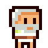
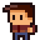
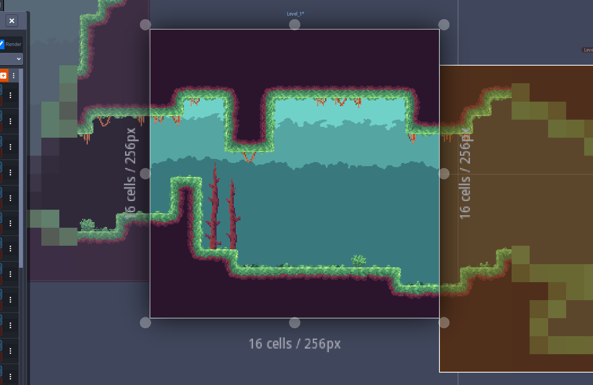
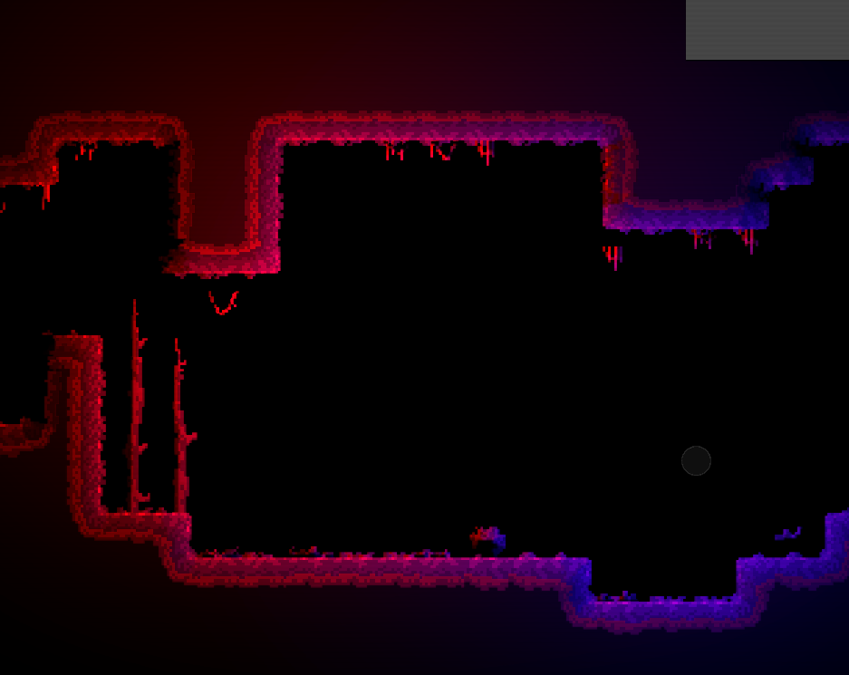
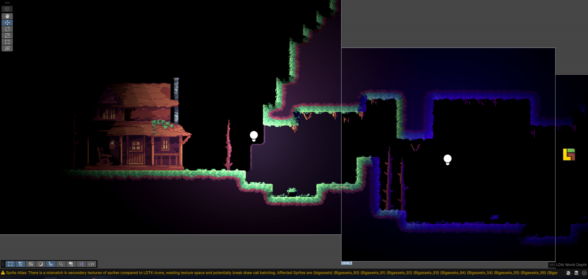

## Hello! 👋
I'm Nick, a game dev and pixel artist from the Netherlands (CET timezone). I love making retro-inspired games and art!

- 🎮 Check out my games on [itch.io](https://nikkcc.itch.io)
- 🎨 I create my own pixel art and designs for my projects
- 💻 Currently learning: C#, JavaScript, AND UNITY!!
- 🕹️ Open to collaborating on Game Jams
- 📫 Reach me: Nick.esselman@gmail.com
- ⏳ Fun fact: I started programming when I was 9! (so 7 years now)

### Pixel Art Animation:

  
  

### Preview of a game I made:

### LDTK:
I have worked with [LDTK](https://ldtk.io) for making autotiles 
and I made Tilesets with Normal maps

  
  
  

